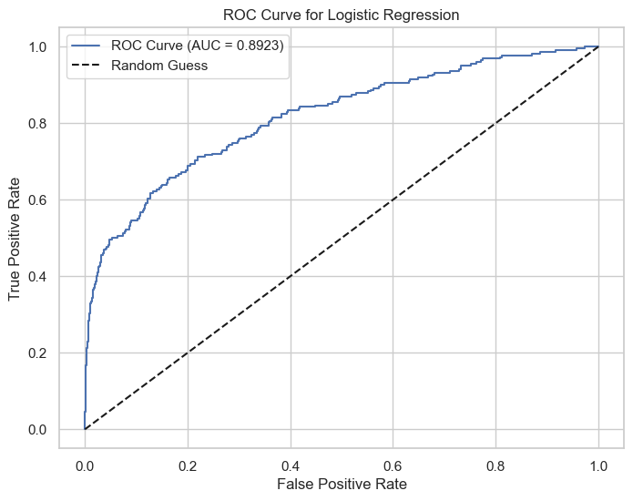
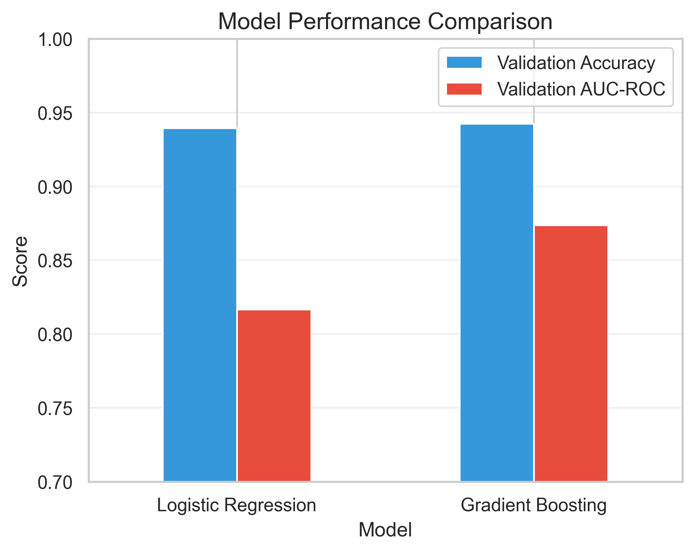

# Credit Default Risk Prediction

## Overview
This project analyzes credit risk using historical financial account data. By applying machine learning techniques, the project predicts the likelihood of credit defaults to support more informed credit approval decisions at a hypothetical regional bank. The primary metric for success is achieving high predictive accuracy as measured by ROC-AUC.

## Problem Description
Financial institutions need reliable ways to assess credit risk. This project aims to use historical data comprising 20 predictor variables to classify account behavior, enabling a robust approach to credit approvals. In doing so, it helps balance operational risk and business opportunity.

## Dataset
Three datasets are used in this project:
- **Training Dataset**: 20,000 accounts
- **Validation Dataset**: 3,000 accounts
- **Hidden Test Dataset**: 5,000 accounts *(available upon request)*
The datasets contain a binary default indicator as the target variable and 20 predictor variables related to credit accounts. More details about the variables can be found in the [Appendix](https://github.com/pranavpatel08/Credit-Default-Risk-Prediction/blob/main/appendix.pdf).

## Project Structure

```
credit-default-risk-prediction/
│   README.md
│   requirements.txt
│   credit_default_prediction.ipynb
└── data/
    └── Train.csv
    └── Validation.csv
└── appendix.pdf
```

* credit_default_prediction.ipynb: Jupyter Notebook containing data loading, preprocessing, exploratory analysis, model building, and evaluation.
* requirements.txt: Python dependencies for running the project.
* README.md: This readme file.
* appendix.pdf: Additional details regarding the dataset features and variable descriptions.

## Methodology
1. Data Preprocessing: Cleans the data and addresses missing values.
2. Feature Engineering: Creates and selects informative features.
3. Modeling: Implements Logistic Regression, Random Forest, and XGBoost.
4. Model Tuning: Uses cross-validation and hyperparameter tuning to optimize performance.
5. Evaluation: Achieves an 89% ROC-AUC and suggests decision thresholds to balance precision and recall.

## Usage
1. Clone this repository:
    ```
    git clone https://github.com/pranavpatel08/Credit-Default-Risk-Prediction.git
    cd Credit-Default-Risk-Prediction
    ```
2. Install dependencies:
    ```
    pip install -r requirements.txt
    ```
3. Run the notebook:
    ```
    jupyter notebook credit_default_prediction.ipynb
    ```

## Running the Analysis
Upon launching the notebook, follow the sequential cells which are organized as follows:
- Data Import and Overview
- Data Preprocessing & EDA
- Feature Engineering and Model Building
- Hyperparameter Tuning and Evaluation
- Conclusions and Future Work

## Results

The analysis evaluated multiple models for credit default prediction.
### ROC Curve Analysis


### Model Performance Comparison



| Model | Validation Accuracy | Validation AUC-ROC | Test AUC-ROC |
|-------|---------------------|---------------------|----------------|
| Logistic Regression | 93.93% | 81.65% | 84.16% |
| Gradient Boosting | 94.23% | 87.36% | 89.23% |


Model performance was evaluated using the ROC-AUC metric, achieving 89% accuracy with Gradient Boosting on the test dataset. Thresholds were recommended to balance precision and recall for credit approvals.


## Contact
For access to the hidden test dataset or any other queries, feel free to reach out.